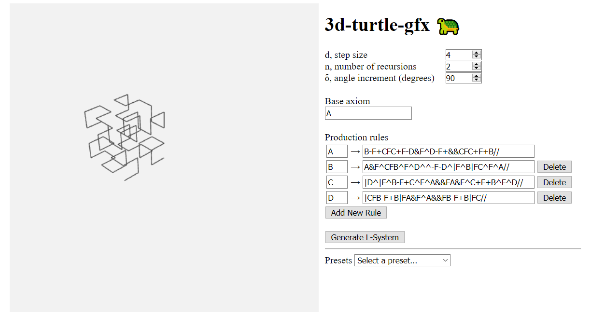

# 3d-turtle-gfx

<p align="center">
  
</p>

## Usage

[Try it here!](https://andypasti.github.io/3d-turtle-gfx/)

To use the program locally, simply clone or download the repository, then open `3d-turtle-gfx.html` in your web browser of choice.

## Background

There are two concepts that are central to understanding the turtle graphics rendering algorithm used in this project: formal grammar systems and turtle interpretation of character strings.

A formal grammar system, often referred to as a grammar, is a set of production rules describing how to transform one string into another. There are many types of grammars, but for this project we focus on one specific type – the Lindenmayer system, or L-system. In an L-system, each character in the initial character string, or “axiom,” is replaced by the string corresponding to the production rule for that character. For example, given the base axiom AB and the production rules A→AB and B→A, the first derivation of this L-system is ABA. We obtained this result by replacing the A and B in the base axiom with AB and A, respectively, as instructed by the production rules.

In a turtle graphics system, we have a drawing cursor referred to as the turtle. In the 2-D case, the turtle sits on some reference coordinate plane and holds a triplet of state variables: x, y, and α. x and y represent the turtle’s current position in the coordinate system while α is an angle describing the turtle’s current heading. Given a step size d and an angle increment δ, the turtle can execute a set of primitive instructions:

```
F : move forward, drawing a line
f : move forward without drawing a line
+ : turn left
- : turn right
[ : push the current state onto a pushdown stack
] : pop a state from the stack
```

As you can see, each of these primitives has a corresponding symbol. One benefit of this is that it makes it easier for computer programs to parse complex instructions. The main advantage, however, is that we can combine the concept of L-systems with this turtle interpretation of characters to generate complex geometries such as fractals.

We can extend this turtle graphics system to 3-dimensions by augmenting the state variables of the turtle. In addition to adding a z-coordinate variable, we replace the heading angle α with a triplet of unit vectors: H, L, and U. Respectively, these vectors represent the heading, upwards-direction, and leftwards-direction of the turtle. Hence, when we want to rotate the orientation of the turtle, we perform the following matrix multiplication:

<p align="center">
  
</p>

Where R is a 3×3 rotation matrix. Using this, we can add the following commands to the turtle graphics system.

```
& : pitch down
^ : pitch up
\ : roll left
/ : roll right
| : turn around
```

In addition to the commands previously listed, the program supports the following turtle commands:

```
L : generate a leaf
P : generate a flower petal
```

These commands simply generate green- and red-colored diamond-shaped polygons, meant to emulate the leaves and flower petals of plants. To illustrate this and the program’s capabilities in general, a list of preset L-systems were implemented which can be accessed via dropdown menu.
